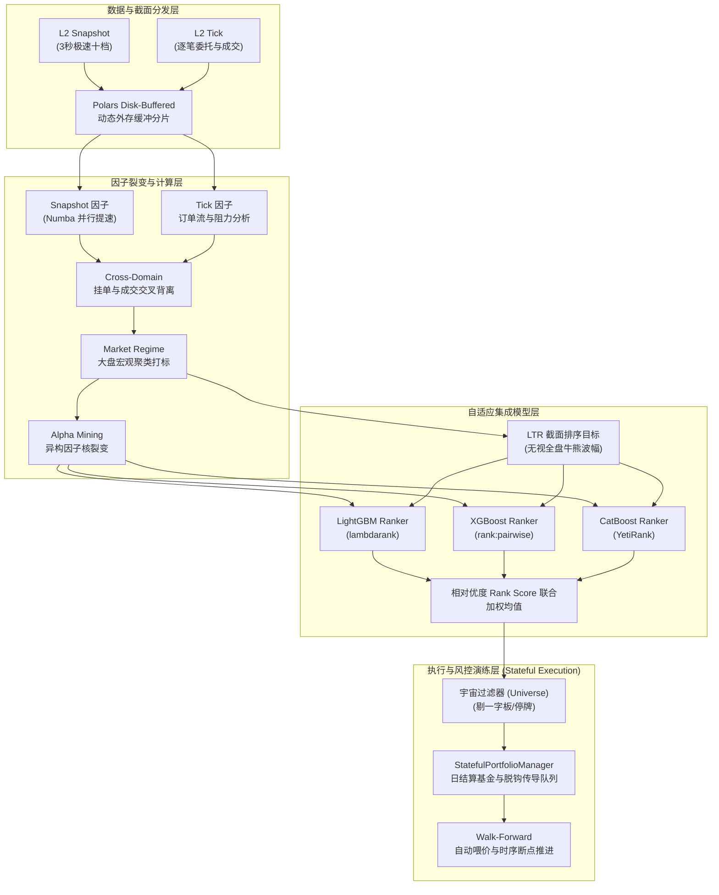

# A股 L2 高频强势股策略 — 完整系统说明文档

> **当前版本**: **V18** (纯净因子库与创业板适配版)
> **核心架构**: 127维微观结构特征 → LTR 动态截面排序标签(Risk-Adjusted Return) → 多源 Ranker 模型集成 (LGB+XGB+CB) → Market Breadth 绝对空仓阻断 → 严格 T+1 状态机无限期移动止盈

---

## 1. 策略概述

本策略是一套完全基于 **A股Level-2超高频数据（Snapshot十档盘口 + Tick逐笔成交）** 构建的次日打板与强势股量化追踪系统。
核心逻辑：利用高频快照与逐笔订单流，提炼主力微观行为、流动性支撑、盘口抢筹意愿等**多达 127 维的跨域深度交叉特征**。通过 **Learning-to-Rank (LTR / 排序学习)** 级联模型，在无视大盘绝对牛熊的背景下，每日挑选出**在当期截面下相对多头动能得分榜首的 Top 3** 标的。由真正独立的日度解耦模拟器 `StatefulPortfolioManager` 于次日开盘接管排队挂单，并执行**无限期的强盗级别游资长期跟盘止盈机制（只要没触及 8% 回撤下台阶，死抱到底）**。

### 核心交易目标与风控限制
| 指标 | 目标要求/规则界限 |
|------|--------|
| **排序标签** | 基于截面相对收益排名 (Rank Percentile) 生成 0~10 的分值，替代固定硬门槛 |
| **选股与去重** | 每日截取模型加权最高 Top 3 标的，并施加**防重复吃进锁**过滤掉手中已有的老将 |
| **仓位与闲水** | 基于相对强弱 `softmax` 动态分配闲置资金权重，受到实盘微观盘口承接容量深度的硬性滑点约束 |
| **极刑移动止盈**| “让利润奔跑，废除时间限制”。每日盘中刷新每个持仓的 `Highest MTM`，击穿最高点缩水 **8%** 才准时割肉落袋 |
| **刚性止损** | 单日绝对跌幅或账列浮套触及 **-5%** 后无条件斩仓清盘，绝不给一字跌停锁死留机会 |
| **系统级空仓熔断** | ① 当 `Rolling Sharpe < -0.5` 触发回撤防线。② (**V15新增**) 日频盘点全网等权中位股票，一旦该宽基10日均线跌穿 `-0.3%` 下行，强制冻结系统、拒绝挂新单。 |

---

## 2. 系统核心架构

---

## 3. 核心机制演进亮点 (V3 → V18)

本系统自迭代以来经历了数个跨度极大的世代演化：

* **纯净因子库与高波动适配版 (V18)**：全面适配创业板/科创板 20% 涨跌幅机制，将目标拉升阈值 (`tp_target`) 提升至 15%，倒逼模型寻找真正具备大级别主升浪爆发力的标的。同时通过 `clean_features.py` 在训练管道中硬性铲除并屏蔽 50+ 失去活性的“DEAD”死因子，净化样本数据质量，使 Walk-Forward 滚动回测胜率重回 40% 以上并恢复风险偏好。
* **动态信念与毒性探测版 (V17)**：在机器学习 Pipeline 原生嵌入微观盘口毒性特征（大单抽离与冰山），重构非线性风险惩罚标签。配合 Z-Score 信念过滤，将原本匀速的试仓资金向模型拥有绝对置信度的头部标的高维倾斜。
* **绝对得分与防骗线版 (V16)**：补全纯排序模型在“全盘皆绿”时的建仓缺陷，增加绝对分数白名单底线门槛；引入了“深V反弹”特殊接管器 (Rebound Override) 及 Fake-Buy 虚假买盘过滤器，预防在极具欺骗性的盘口与 V 型反转中踏空或接飞刀。
* **宽基防火墙与夏普目标平滑版 (V15)**：在经历大熊市巨幅回撤后，洗心革面引入双轨防灾。一是从靶心上重构标签，变更为 `risk_adj_return = future_close_return + future_max_drawdown * 1.5`，让模型痛定思痛、不再沉迷追击妖股的高光时刻却屡接飞刀，转向寻找能在盘内抗住抛压稳守收官的主力温和控盘股；二是建立了独立于微观 Alpha 外的绝对“大盘宽基监控器”（利用全A股四千只股票截面得出无偏的 Market Breadth 中位表现），实现股灾期断头式物理隔离阻断开仓机制，凭此双剑合璧最大回撤被疯狂收缩至强悍的 `-8.50%`。
* **状态机持仓传导管线 (V14)**：剥离了原来预知“T+2开收盘”强行结算的虚假框架。正式引入真实的 `StatefulPortfolioManager` 机制，当日信号转化为盘后 `pending` 挂单队列，次日开盘方可接入，且只要盘中不再触及最高点回撤 8% (Highest MTM Trailing Stop)，就会一直跨日连抱到底，实现了单只标的真正的复利无限持有。
* **全量管线畅通无损 (V13)**：彻底修复了底层由于 `os error 2` 与 `spawn` 死锁导致的大规模特征丢失。清洗了预测端异常严重的 `INF` 偏倚，彻底打通了从基础构建到机器学习打分每一环节的血脉，唤醒所有原本丢失沉睡的 Cross-Domain 与 V9 涨停因子，系统能力重回 127 维巅峰。
* **僵尸特征动态剥离机制 (V12)**：新增生命周期追踪引擎，当子进程检测到死链与长期对模型增益为 0 的历史“僵尸因子”时，利用黑名单将其彻底隔离禁载，净化系统计算资源并保障过拟合防范。
* **LTR 排序学习引擎 (V11)**：彻底摒弃了由于分类问题在弱势市场正样本全部流失、模型塌方退化的问题。将 LightGBM、XGBoost 与 CatBoost 全部升级为 `Ranker` 系列，直接预测股票在同日截面内的赚钱能力排序。
* **微观结构巅峰集结 (V10.2)**：全方位铺开 A 股专用打板引力模型、隐藏订单/算法拆单追踪（幽灵流动性/同量拆解）、以及极度细致的 Volume Profile 偏度重构。
* **超大外存承载 (Disk-Buffered, V10)**：修复了由于 `pl.DataFrame` 千万行大合并导致 `[WinError 112] 磁盘空间不足`（C盘临时溢出崩溃），强制采用分片抛盘到专属机械外存缓冲的技术。
* **自适应标签体系 (V9)**：放弃了绝对死板的“涨幅必须超10%”机械性标签，变更为根据市场历史波动率自动收缩/膨胀的动态寻优阈值。模型在熊市下也能敏锐捕捉小级别反弹。
* **宏观态势感知 (Market Regime)**：通过 `market_regime_gmm.py` 在因子拼装环节从全市场加总情绪因子中提取聚类，给预测模型传递全局冷暖状态。由于熊市空防需求，新增了 `Rolling Sharpe Circuit Breaker` 回撤熔断器。
* **时序防伪隔离 (Purge-Embargo, V8)**：在 Walk-Forward 滚动中主动“抹去”最后 2 天数据，彻底断绝强学习器跨天偷看未来标签。

---

## 4. 深度因子体系

因子库被彻底拆解为快照域、逐笔域、时序域，并在最新重构中合成了**跨域融合特征**及**主观聪明钱（SMC）**探测。

### 4.1 盘口快照因子 (Snapshot, Numba加速)
| 因子类别 | 代表字段 | 计算逻辑与内涵 |
|---------|----------|----------------|
| **深度失衡** | `ofi_sum`, `oir_10` | 十档净委托流的非线性衰减累加。正值指买方建仓刚性极强。 |
| **纵深与方差** | `depth_var_last`, `book_slope`| 买卖20档的方差/斜率。防范假单骗线，大单呈集聚状或梯状防守。 |
| **极限界定** | `liquidity_void_rate` | 流动性真空度。扫描价格跳空缺口与盘口接盘薄弱区（V8新增）。 |
| **异常撤单** | `cancel_ratio_extreme` | 高频爆量撤单占比。追踪大单频繁挂撤“秀肌肉”诱多主力的拆单行为（V9）。 |
| **资金引力** | `limit_up_magnet_effect`| 涨停磁吸效应。探测被封板时尾盘隐性扫单。 |

### 4.2 极速逐笔因子 (Tick, 微观量化)
| 因子类别 | 代表字段 | 计算逻辑与内涵 |
|---------|----------|----------------|
| **流入测算** | `big_net_inflow`, `sweep_intensity`| 超大单/大单的纯净流入刻画，单笔最速穿透率 (Sweep)。 |
| **流动性毒性**| `vpin_vol_bucket`, `amihud_illiq` | VPIN 衡量内幕资金信息非对称优势，Amihud 判断砸盘阻力。 |
| **打板与空间** | `poc_distance`, `limit_up_consumption_rate` | Volume Profile (VP) 中枢偏离度，临近涨停的筹码消耗速度。 |
| **暗盘检测** | `phantom_liquidity`, `trade_size_clustering` | 检测虚假撤弹挂盘（Spoofing）、极具规律的同量算法冰墙拆单。 |

### 4.3 SMC 与 跨维度防御 (V11 进化)
融合了外盘主流的 `Smart Money Concept` 并注入极致下行防线：
* **`smc_wyckoff_accum`**: 威科夫吸筹阶段的窄幅动能静默度。
* **`smc_liquidity_sweep`**: 价格穿越前高后跌回引发的流动性扫损猎杀。
* **`tail_risk_skew`**: (防守核心) 暴跌时成交极大放出，企稳反弹时极端缩量的“断头镰刀”警报仪。
* **`relative_volume_rank_10m`**: (跨股截面) 高频统计全市场该分时内该股疯狂吸血资金的前 N% 排名。

### 4.4 Alpha Mining 动态衍生矿机
在每 20 天的重训切片内，系统调动 `factor_generator.py` 对原始基础列进行组合变异操作（A/B, A-B, A*B 等四则运算），强制进行 **Rank IC 挖掘**。符合 `|IC| > 0.02` 并且与已有成分 **正交去冗（相关系数 < 0.7）** 的特征将作为当阶段的“神之因子”注入模型。

---

## 5. Walk-Forward 模型引擎

由于金融时间序列强非平稳，系统不采用全局划分，而使用工业标杆的**滑动前传 (Walk-Forward)**：
1. **训练窗口**: 默认 100~200 天滚动截留。
2. **测试滑移**: 每测试预测 20 天，强制暂停实盘进程。
3. **滚动重训 (Retrain)**: 读取最新数据流，剔除末席 2 天切断泄漏，利用 `set_group` (Ranker机制) 或者原始 `Dataset` 续写增量梯度树。
4. **模型拼图**: LightGBM（叶子导向极速）、XGBoost（深限度鲁棒）、CatBoost（暴力类别拟合）三大排序评估模型分别对截面打分（Score）。总分直接联合平均叠加，按日提取 **Score Top 3** 的强势股发送次日建仓指令。

---

## 6. 风控体系与选股过滤

交易执行环节被安置在 `universe_filter.py` 强拆弹层：
1. **垃圾标的剔除**: 去除 `ST`、新股未开板、昨日收盘 `last=0` 瘫痪股。
2. **拒绝接盘**: 若开盘 `touched_limit_up = 1`（一字涨停被顶死），因实际无法进入买入队列，系统直接抛弃该标的，防止纸上富贵回测。
3. **资金重分配**: 未用尽单票 50% 上限仓位的富余现金，将在下一只选股上根据预测概率（`softmax`）平滑溢出。

### 回测扣费标定
| 项目 | 惩罚幅度设定 |
|------|-----------|
| **建仓滑点佣金** | 买入双边万 2.5 覆盖率 |
| **税收离场成本** | 单边万 5 （千分之一量级严苛设定）|

---

## 7. 代码与文件速览

| 职责分离 | 负责文件 |
|---------|----------|
| **主脉络与流程** | `batch_pipeline.py` (聚合与 WF 逐日状态推演) / `v9_launcher.py` (极速启动器) / `run.py` |
| **特征提报兵工厂**| `engine.py` (Snap主导) / `custom_factors.py` (Numba挂单测算) / `tick_factors.py` (盘口吃单量化) |
| **黑盒与挖掘** | `ml_pipeline.py` (三架构统筹/特征构造) / `factor_generator.py` (自动挖矿) |
| **宏观与裁判** | `market_regime_gmm.py` (高维空间环境聚类) / `universe_filter.py` / `backtest_simulation.py` (包含 Stateful PM 基金经理) |

---
**本架构由 Google Antigravity 协助打造，拥有工业极高数据宽容度与泛化力。**
